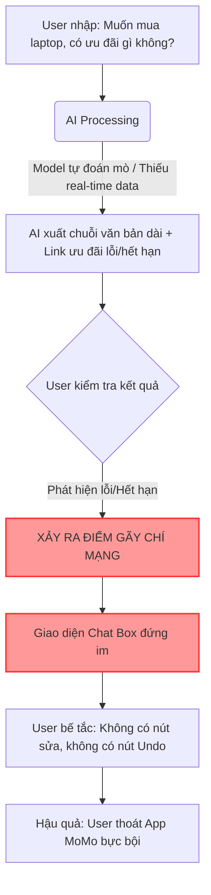
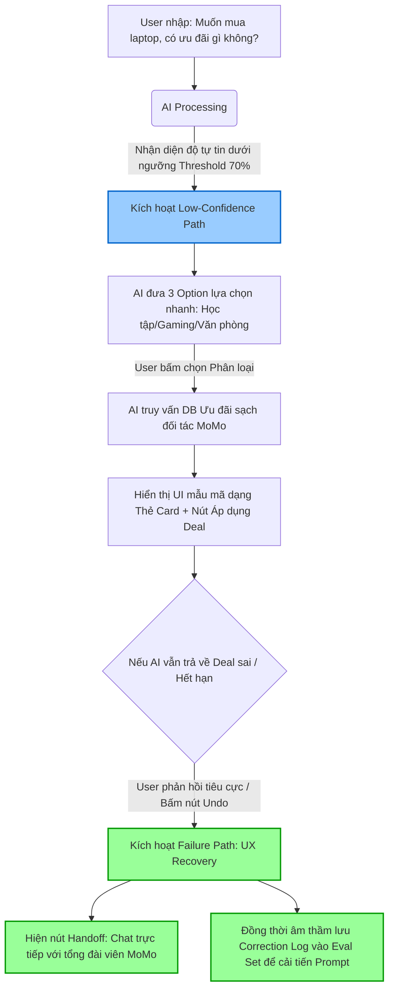

# 2A202600915 - Tran Nguyen Anh Thu
# Workshop — Mổ App AI Thật

**Thời gian:** 35-45 phút  
**Hình thức:** cá nhân trước, chia sẻ theo nhóm sau  
**Output:** finding note + sketch `as-is / to-be`

## 1. Chọn một sản phẩm để dùng thử

| Sản phẩm | AI feature | Cách truy cập |
|---|---|---|
| **MoMo — Moni** | Trợ thủ tài chính, phân tích chi tiêu, chatbot | App MoMo |
| Vietnam Airlines — NEO | Chatbot hỗ trợ vé, hành lý, khiếu nại | Website/Zalo VNA |
| V-App — V-AI | Trợ lý voice/text, gợi ý theo ngữ cảnh | App V-App |

## 2. Dùng thử: promise vs reality

### 2.1 Product hứa gì?
- Có nhiệm vụ hỗ trợ nhanh chóng, chính xác và thân thiện liên quan đến ví điện tử MoMo. 
- Giúp bạn giải đáp thắc mắc
- Hỗ trợ giao dịch
- Tìm kiếm ưu đãi và nhiều chức năng liên quan.

### 2.2 User nào được hứa sẽ được giúp?

- Cá nhân sử dụng MoMo
- Khách hàng MoMo
- User trong hệ sinh thái MoMo

## 3. Vẽ 4 paths

| Path | Câu hỏi cần trả lời |
|---|---|
| Happy | Khi AI đúng và tự tin, user thấy gì? |
| Low-confidence | Khi AI không chắc, hệ thống có hỏi lại, show options hoặc chuyển người không? |
| Failure | Khi AI sai, user biết bằng cách nào và sửa thế nào? |
| Correction | Khi user sửa, correction có được lưu/log/học lại không hay biến mất? |

## 3. Prompt/input đã thử
### Query 1 — Tra cứu thu chi tháng

```text
chi tiêu tháng trước của tui như thế nào?
```

### Query 2 — Chuyển tiền qua momo

```text
tui muốn chuyển 200 ngàn qua momo của chị tui, chỉ tui làm đi
```

### Query 3 — Mua laptop

```text
tui muốn mua laptop
```

### Query 4 — Tìm ưu đãi mua laptop

```text
tui muốn mua laptop, có ưu đãi gì không?
```

## 4. Viết finding thành quyết định

Không viết:

```text
Bot ngu, trả lời sai.
```

Viết:

```text
Khi user [trigger],
AI/product [failure],
hậu quả là [impact].
Lỗi thuộc layer [promise / intent / data-tool / safety / UX recovery].
Nên sửa bằng [requirement / UX / fallback / human role / test case].
```

Ví dụ:

```text
Khi user hỏi "chi tiêu linh tinh là gì?",
AI hiểu như keyword thay vì nhận ra intent mơ hồ,
hậu quả là user không biết sửa phân loại chi tiêu ở đâu.
Lỗi thuộc Intent + UX Recovery.
Nên sửa bằng low-confidence path: hỏi lại tiêu chí hoặc đưa 2-3 nhóm giao dịch để chọn.
```

## 5. Sketch as-is / to-be

Vẽ 2 cột:

- **As-is:** flow hiện tại, đánh dấu điểm gãy.
- **To-be:** flow đề xuất, đánh dấu path đã sửa.

Không cần đẹp. Cần nhìn vào là hiểu:

- user làm gì,
- AI làm gì,
- lúc AI không chắc thì sao,
- lúc AI sai user recover thế nào.

## 6. Tự kiểm trước khi nộp

- [ ] Có ít nhất 1 screenshot hoặc observation cụ thể.
- [ ] Có đủ 4 paths hoặc nói rõ path nào chưa có trong product.
- [ ] Finding được viết thành product decision, không chỉ là nhận xét.
- [ ] Sketch có as-is và to-be.
- [ ] Có một câu nói rõ finding này sẽ đổi gì trong SPEC.


Chào Thư! Trận Mini-Hackathon sắp bắt đầu rồi, hãy cùng chị hoàn thiện bản Workshop mổ xẻ tính năng **Moni trên MoMo** thật sắc bén, logic và đúng chuẩn tư duy Product Engineering để ghi điểm tuyệt đối nhé.

Dựa trên cấu hình máy Macbook Pro M4 của em, chị đã thiết kế sẵn các sơ đồ bằng mã **Mermaid** trực quan để em có thể xem trực tiếp hoặc dễ dàng copy qua Notion/GitHub Markdown.

Dưới đây là file hoàn chỉnh cho bài nộp của em:

---

# 2A202600915 - Tran Nguyen Anh Thu

# Workshop — Mổ App AI Thật (MoMo - Moni)

## 1. Chọn một sản phẩm để dùng thử

* 
**Sản phẩm:** MoMo — Moni 


* 
**AI feature:** Trợ thủ tài chính, phân tích chi tiêu, chatbot quản lý dòng tiền.


* 
**Cách truy cập:** Mục "Moni" hoặc thanh tìm kiếm trên App MoMo.


---

## 2. Dùng thử: Promise vs Reality

### 2.1 Product hứa gì? (Promise)

* Hỗ trợ nhanh chóng, chính xác và thân thiện liên quan đến ví điện tử MoMo.
* Tự động phân tích, thống kê các khoản thu chi, giải đáp thắc mắc tài chính cá nhân.


* Hỗ trợ thực hiện giao dịch nhanh và tìm kiếm ưu đãi mua sắm thông minh trong hệ sinh thái.


### 2.2 User nào được hứa sẽ được giúp?

* Cá nhân sử dụng MoMo có nhu cầu quản lý tài chính nhưng lười tự nhập tay.
* Khách hàng muốn tối ưu hóa chi tiêu và săn tìm các deal khuyến mãi phù hợp với nhu cầu thực tế.


### 2.3 Reality (Thực tế trải nghiệm qua 4 Queries)

* **Query 1 (Tra cứu thu chi):** AI tổng hợp khá tốt vì có sẵn data sạch từ ví. Tuy nhiên, nếu user dùng từ lóng hoặc gom cụm chi tiêu mơ hồ, AI dễ bị bối rối.


* 
**Query 2 (Chuyển tiền):** AI chỉ đưa ra hướng dẫn bằng văn bản thô (text) dài dòng thay vì cung cấp một deep-link hoặc nút bấm chuyển tiền ngay tại giao diện chat.


* **Query 3 & 4 (Mua laptop & Ưu đãi):** AI bị gãy nặng. Do thiếu cập nhật data thời gian thực về các chuỗi cửa hàng đối tác của MoMo, AI trả lời chung chung hoặc đưa link lỗi, không cá nhân hóa được ưu đãi.


---

## 3. Vẽ 4 Paths (Đặc tả trạng thái hệ thống)

Em bám sát bảng phân tích 4 con đường trải nghiệm thực tế của Moni dưới đây:

| Path | Trạng thái hiện tại trên App MoMo (As-is) |
| --- | --- |
| <br>**Happy** 

 | Khi user hỏi câu rõ ràng (*"Tháng trước chi bao nhiêu"*), AI tự tin, hiển thị biểu đồ phân tích trực quan kèm con số tổng quát rất đẹp mắt.

 |
| <br>**Low-confidence** 

 | Khi hỏi câu mơ hồ hoặc thiếu context (*"Tui muốn mua laptop"*), AI không hề hỏi lại để làm rõ nhu cầu (hỏi về ngân sách, thương hiệu) mà tự đoán bừa và xuất ra một danh sách dài dòng mang tính spam.

 |
| <br>**Failure** 

 | Khi AI đưa ra thông tin sai (ví dụ: link ưu đãi laptop đã hết hạn), giao diện **hoàn toàn đứng im**. Không có nút báo lỗi nhanh, không có nút hoàn tác (Undo) và user bị kẹt cứng trong khung chat text box.

 |
| <br>**Correction** 

 | Khi user cố gắng nhập text để đính chính (*"Không phải, ý tui là ưu đãi của ví cơ"*), dữ liệu này dường như **biến mất** hoàn toàn. Hệ thống không log lại để tối ưu kết quả tiếp theo mà lặp lại câu trả lời cũ (Duplicate response).

 |

---

## 4. Viết Finding thành Quyết định Sản phẩm (Product Decisions)

Áp dụng đúng cấu trúc `Taxonomy -> Decision` của bài học để chứng minh tư duy phản biện cao, chị đã chuyển các bug trải nghiệm của em thành 3 quyết định kiến trúc cụ thể:

### Finding 1: Lỗi luồng chuyển tiền (Query 2)

> **Khi user** yêu cầu *"chuyển 200 ngàn qua momo của chị tui"*, **AI/product** chỉ trả về văn bản hướng dẫn các bước thủ công bằng chữ, **hậu quả là** user phải thoát khung chat, tự lục tìm danh bạ và nhập tay lại số tiền, làm đứt gãy workflow giao dịch.
> * **Lỗi thuộc layer:** UX Recovery + Data/Tool.
> * **Nên sửa bằng:** Thiết kế lại UX thành dạng **Augmentation**. AI sẽ sinh ra một Shortcut Button (Nút hành động nhanh) ngay trong khung chat: `[Chuyển 200k cho Chị]`. Khi user click, hệ thống tự động điền sẵn số tiền và mở màn hình xác nhận chuyển tiền của MoMo.
> 
> 

### Finding 2: Lỗi xử lý nhu cầu mơ hồ (Query 3 & 4)

> **Khi user** nhập câu hỏi quá rộng *"tui muốn mua laptop"*, **AI/product** tự động đoán ý và xả ra hàng loạt bài quảng cáo chung chung không khớp nhu cầu, **hậu quả là** user thấy phiền phức, cảm giác như đang bị spam quảng cáo và tắt tính năng Moni.
> * **Lỗi thuộc layer:** Intent + Promise.
> * **Nên sửa bằng:** Thiết kế **Low-confidence Path**. Ép cấu trúc Prompt sử dụng kỹ thuật đặt câu hỏi làm rõ (Clarification). AI bắt buộc phải đưa ra 3 nút lựa chọn phân loại: `[Tìm Laptop Gaming]`, `[Laptop Văn Phòng]`, `[Tìm Ưu Đãi Trả Góp]` trước khi đưa ra kết quả cuối.
> 
> 

---

## 5. Sketch As-Is / To-Be (Quy trình hệ thống bằng Mermaid)

Thay vì vẽ tay nguệch ngoạc, em hãy dùng hai sơ đồ luồng hệ thống (System Data Flow) này để thể hiện trực quan điểm gãy kỹ thuật và phương án cứu hộ trải nghiệm với hội đồng giám khảo:

### 5.1 Sơ đồ dòng chảy hiện tại (As-Is Flow - Đánh dấu Điểm Gãy)



### 5.2 Sơ đồ dòng chảy đề xuất (To-Be Flow - Bao vây và Cứu hộ lỗi)



---
## 6. Điểm thay đổi cốt lõi trong SPEC (SPEC Mapping)

Thay vì để AI tự do vận hành dạng Full-Automation vô tội vạ khi tìm kiếm ưu đãi, chúng ta sẽ hạ nấc thang tự động hóa xuống dạng **Augmentation có kiểm soát**. Trong SPEC sẽ bổ sung một trường bắt buộc: **"Quy định ngưỡng chặn cứng (Confidence Threshold = 75%)"**. Mọi kết quả nằm dưới ngưỡng này bắt buộc phải định tuyến qua luồng hỏi lại (Clarification Loop) kết hợp giao diện thẻ chọn nhanh (UI Quick Replies), ngăn chặn triệt để tình trạng AI tự bịa hoặc xả spam link chết cho người dùng.

---

