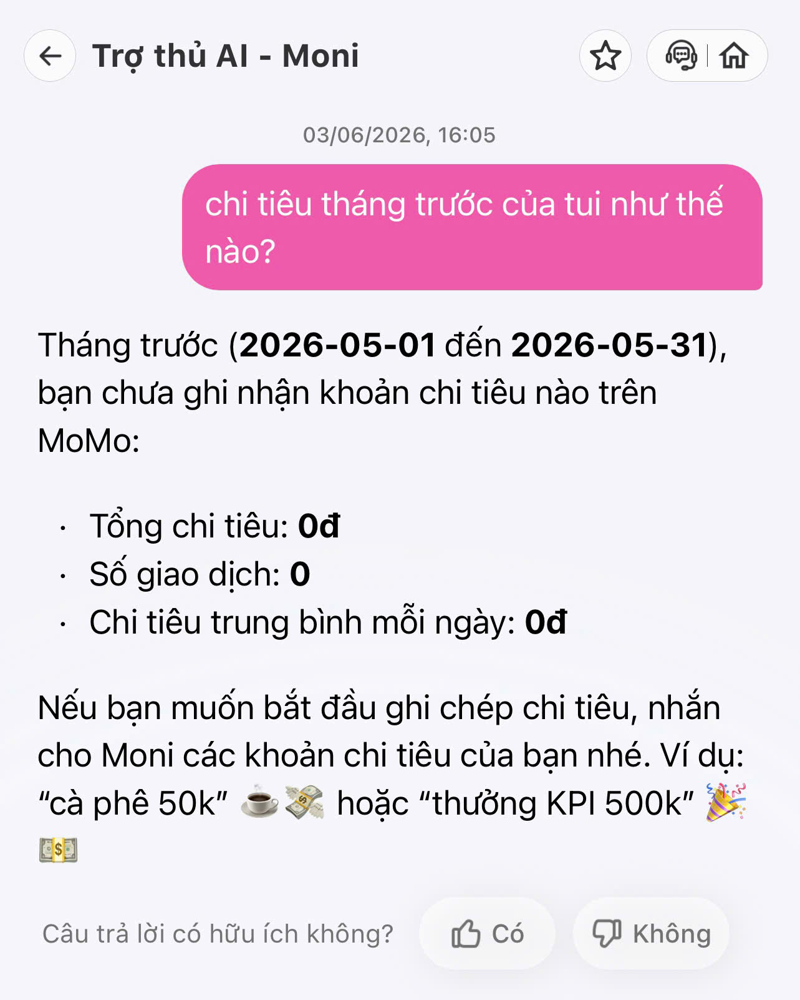
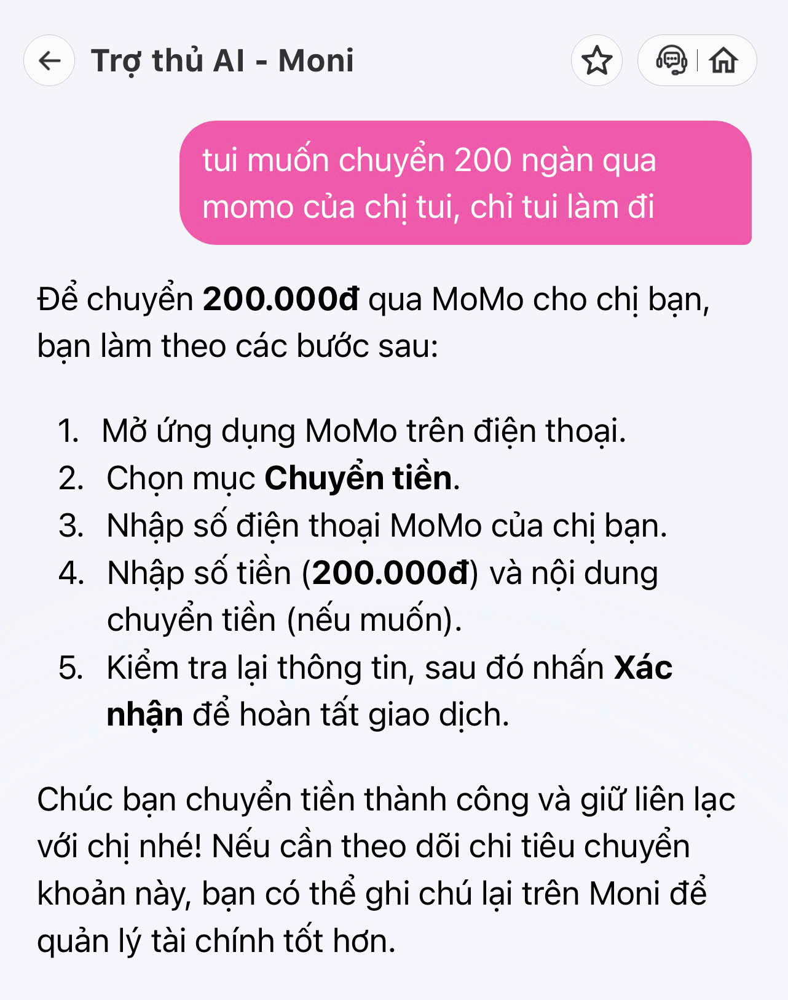
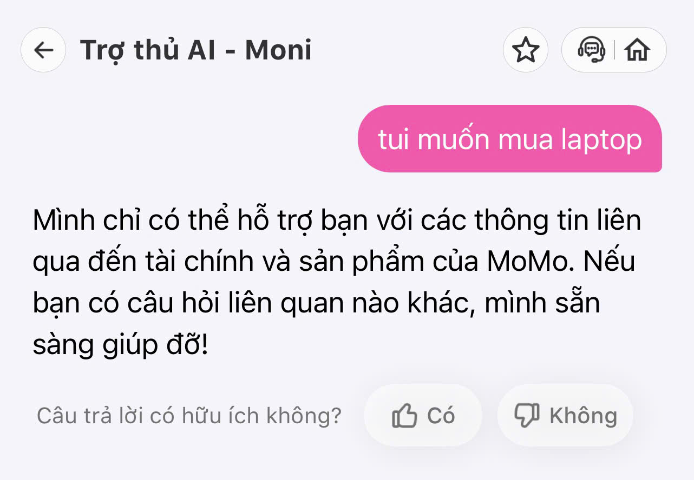
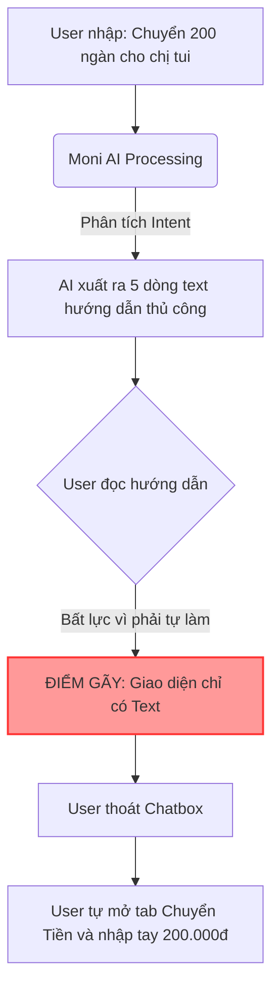
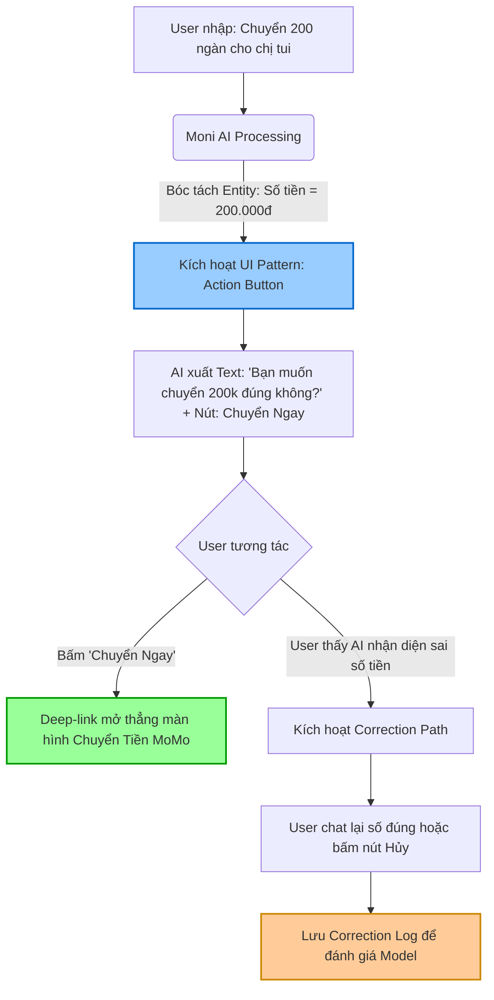

# 2A202600915 - Tran Nguyen Anh Thu
# Workshop — Mổ App AI Thật

**Thời gian:** 35-45 phút  
**Hình thức:** cá nhân trước, chia sẻ theo nhóm sau  
**Output:** finding note + sketch `as-is / to-be`

## 1. Chọn một sản phẩm để dùng thử

| Sản phẩm | AI feature | Cách truy cập |
|---|---|---|
| **MoMo — Moni** | Trợ thủ tài chính, phân tích chi tiêu, chatbot | App MoMo |
| Vietnam Airlines — NEO | Chatbot hỗ trợ vé, hành lý, khiếu nại | Website/Zalo VNA |
| V-App — V-AI | Trợ lý voice/text, gợi ý theo ngữ cảnh | App V-App |

## 2. Dùng thử: promise vs reality

### 2.1 Product hứa gì?
- Có nhiệm vụ hỗ trợ nhanh chóng, chính xác và thân thiện liên quan đến ví điện tử MoMo. 
- Giúp bạn giải đáp thắc mắc
- Hỗ trợ giao dịch
- Tìm kiếm ưu đãi và nhiều chức năng liên quan.

### 2.2 User nào được hứa sẽ được giúp?

- Cá nhân sử dụng MoMo
- Khách hàng MoMo
- User trong hệ sinh thái MoMo

## 3. Vẽ 4 paths

| Path | Câu hỏi cần trả lời |
|---|---|
| Happy | Khi AI đúng và tự tin, user thấy gì? |
| Low-confidence | Khi AI không chắc, hệ thống có hỏi lại, show options hoặc chuyển người không? |
| Failure | Khi AI sai, user biết bằng cách nào và sửa thế nào? |
| Correction | Khi user sửa, correction có được lưu/log/học lại không hay biến mất? |

## 3. Prompt/input đã thử
### Query 1 — Tra cứu thu chi tháng

```text
chi tiêu tháng trước của tui như thế nào?
```

### Query 2 — Chuyển tiền qua momo

```text
tui muốn chuyển 200 ngàn qua momo của chị tui, chỉ tui làm đi
```


### Query 3 — Mua laptop

```text
tui muốn mua laptop
```

### Query 4 — Tìm ưu đãi mua laptop

```text
tui muốn mua laptop, có ưu đãi gì không?
```


## 4. Viết finding thành quyết định

### Finding 1: Đứt gãy luồng giao dịch ( Query 2)

```text
Khi user yêu cầu "chuyển 200 ngàn qua MoMo của chị tui", 
AI/product chỉ trả về văn bản hướng dẫn 5 bước thủ công, 
hậu quả là user phải thoát khung chat, tự thao tác lại từ đầu, làm đứt gãy luồng giao dịch và trải nghiệm rất "chạy bằng cơm".
Lỗi thuộc layer UX Recovery + Promise (Hứa hỗ trợ giao dịch nhưng thực chất chỉ trả text).
Nên sửa bằng UX UI Pattern dạng Augmentation: Thay vì trả text, AI phải sinh ra một Widget/Nút bấm [Chuyển 200.000đ]. Khi user bấm vào, app tự mở màn hình chuyển tiền đã fill sẵn số tiền.
```

### Finding 2: Lỗi Hallucination/Lạc đề khi thiếu dữ liệu (Query 4)

```text
Khi user hỏi "muốn mua laptop, có ưu đãi gì không?", 
AI/product trả về deal giảm 10.000đ cho hóa đơn Internet, 
hậu quả là user thấy phiền phức, giống như bị spam quảng cáo sai tệp.
Lỗi thuộc layer Intent + Data/Tool (Không có data nhưng vẫn cố trả lời).
Nên sửa bằng Fallback (Low-confidence path): Nếu query database không có deal Laptop, AI phải thừa nhận "Mình chưa có deal Laptop lúc này" và đưa 3-4 nút bấm gợi ý các danh mục đang có sẵn (Ví dụ: Deal Ăn Uống, Deal Điện Nước) thay vì nhét bừa một voucher sai ngữ cảnh.
```

## 5. Sketch as-is / to-be

- **As-is flow:** 


- **To-be flow:** 

## 6. Tự kiểm trước khi nộp

- [X] Có ít nhất 1 screenshot hoặc observation cụ thể.
- [X] Có đủ 4 paths hoặc nói rõ path nào chưa có trong product.
- [X] Finding được viết thành product decision, không chỉ là nhận xét.
- [X] Sketch có as-is và to-be.
- [X] Có một câu nói rõ finding này sẽ đổi gì trong SPEC.