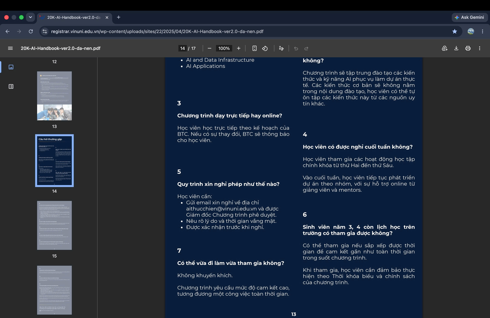
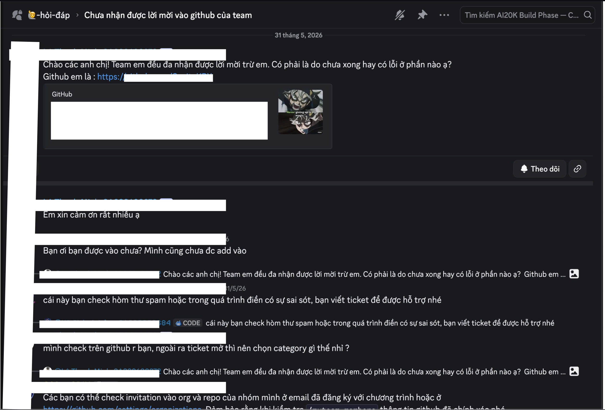

# Template — Evidence Pack

Nộp kèm thin SPEC cuối Day 05.

## 1. Nhóm và track

**Tên nhóm:**  Duy Bảo, Hữu Khoa, Anh Thư
**Track:**  A. Learning OS (VinAI Thực chiến)
**Product/app đã chọn:**  Website VinUni
**Build slice đang nghĩ:**  Chatbot tư vấn chương trình VinAI Thực chiến

## 2. Self-use evidence

| Observation | Screenshot/link | Path liên quan | Điều học được |
|---|---|---|---|
| Mở Handbook PDF 17 trang ra để tìm xem "Sinh viên năm cuối có được tham gia không?", phải dùng Ctrl+F quét mới ra kết quả ở trang 13. |  | Happy | User lười đọc document dài. Bot cần trích xuất trực tiếp câu trả lời kèm số trang thay vì quăng lại cả file. |
| Lên nhóm hỗ trợ hỏi về "Lỗi setup môi trường", kết quả ra 1 đống tin nhắn đứt đoạn, không biết đâu là câu trả lời chốt cuối cùng của Mentor. |  | Low-confidence / Failure | Data trên nhóm hỗ trợ rất nhiễu. Nếu AI không tổng hợp được context, nó sẽ sinh ảo (Hallucination) hoặc trả lời sai. Cần thiết kế Fallback tag thẳng Mentor nếu bot không chắc chắn. |

## 3. User / review / social evidence

Nguồn có thể là review App Store/Play, group, comment, phỏng vấn nhanh, hoặc nguồn public khác.

| Quote / review / observation | Nguồn | User là ai? | Pain/failure mode |
|---|---|---|---|
| "Hi admin, anh/chị cho em xin slide bài giảng buổi 3 nhé." | Discord | Học viên | Tìm kiếm thông tin vận hành lắt nhắt tốn thời gian, trôi tin nhắn. |
| "Mọi người có ai không làm được daily không ạ, hôm qua em làm bình thường nhưng hôm nay lại báo chỉ dùng được trong thread của team ạ" | Discord | Học viên | Đang kẹt lỗi kỹ thuật |


## 4. Competitor / analog evidence

| App / mô hình tham khảo | Họ xử lý task này thế nào? | Pattern học được | Có áp dụng trong 1 ngày không? |
|---|---|---|---|
| Chatbot tư vấn tuyển sinh đại học (Rule-based) | Trả lời theo kịch bản cố định (nhấn phím 1, phím 2). Hỏi lệch kịch bản là báo lỗi hoặc xin số điện thoại. | Trải nghiệm rất gò bó (Robotic). Nhưng cơ chế fallback "Xin thông tin để tư vấn viên gọi lại" rất an toàn. | Có. Nhóm dùng LLM để chat mượt hơn (Augment), nhưng giữ lại nút "Gửi câu hỏi cho Mentor" khi AI bó tay.|
|DataCamp / Coursera AI Assistant|Đưa ra gợi ý code, giải thích khái niệm hẹp ngay trong bài học. Sai thì user bấm dislike.| Thu thập learning signal qua nút Vote (Approve/Reject) để đánh giá độ chính xác.|Dựng UI có 2 nút Thumbs Up / Thumbs Down đơn giản.|

## 5. Evidence -> Insight

```text
Evidence nổi bật nhất:
Học viên liên tục hỏi đi hỏi lại những câu đã có trong Handbook, và thường xuyên bị kẹt ở các lỗi kỹ thuật lặp lại trên Discord mà phải đợi Mentor online mới giải quyết được.

Insight:
User không chỉ gặp vấn đề thiếu thông tin (surface problem). Thật ra họ cần một "người hỗ trợ trực chiến" giải quyết nhanh gọn sự chênh lệch trình độ đầu vào, và cần sự tin tưởng (trust) rằng câu trả lời này chuẩn xác từ Ban tổ chức.

Opportunity:
AI có thể giúp bằng cách tự động hóa (Automate) việc trả lời 100% các câu hỏi FAQ về chính sách/thủ tục. Đồng thời trợ lực (Augment) mảng hỏi đáp kỹ thuật bằng cách đưa ra gợi ý sửa lỗi nháp, cho phép học viên thao tác nhanh trước khi phải gọi Mentor.
```

## 6. Evidence đổi SPEC như thế nào?

- [ ] Đổi user chính.
- [ ] Đổi pain statement.
- [ ] Đổi build slice.
- [X] Đổi Auto/Aug decision.
- [X] Đổi 4 paths.
- [X] Đổi failure mode.
- [ ] Đổi owner/test plan.

Ghi rõ 1-2 thay đổi quan trọng:

```text
Trước evidence, nhóm định: 
Làm một con bot gom chung mọi câu hỏi, AI tự do trả lời tất cả (Full-Automation).

Sau evidence, nhóm đổi thành: 
Phân luồng quyết định (Routing Decision). 
1. Câu hỏi thủ tục/hành chính -> Automate trả lời 100% dựa trên Handbook (kèm trích dẫn).
2. Câu hỏi kỹ thuật/lỗi code -> Augment (AI đưa ra hướng dẫn nháp dựa trên Discord history, nhưng kèm nút "Báo cáo Mentor" nếu chạy thử vẫn lỗi).

Lý do: 
Tránh rủi ro (Failure Mode) AI bịa code sai khiến học viên chạy lỗi hệ thống rồi nản lòng. Áp dụng đúng tư duy "Lỗi báo nhầm đắt hơn hay bỏ sót đắt hơn" của Day 5.
```
